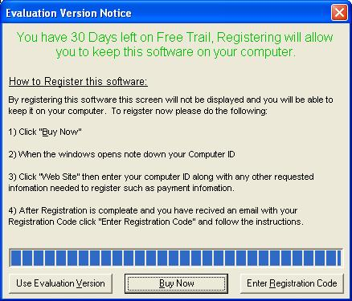



## Adams 30 Day Registration Trial System

### Description

This is a secure 30 day trial system which gives users of your program 30 days to try out your program before they can buy using there unique computer ID. This software also comes with Clock-Back detection. I payed someone on Rent-A-Code to make me this. Please leave comments and vote.

Thanks.
 
### More Info
 

             |
---                |---
**Submitted On**   |2005-07-23 21:32:22
**By**             |[Adam Ranshaw](https://github.com/Planet-Source-Code/PSCIndex/blob/master/ByAuthor/adam-ranshaw.md)
**Level**          |Intermediate
**User Rating**    |4.3 (60 globes from 14 users)
**Compatibility**  |VB 5\.0, VB 6\.0
**Category**       |[Registry](https://github.com/Planet-Source-Code/PSCIndex/blob/master/ByCategory/registry__1-36.md)
**World**          |[Visual Basic](https://github.com/Planet-Source-Code/PSCIndex/blob/master/ByWorld/visual-basic.md)
**Archive File**   |[Adams\_30\_D1916817242005\.zip](https://github.com/Planet-Source-Code/adam-ranshaw-adams-30-day-registration-trial-system__1-61868/archive/master.zip)

